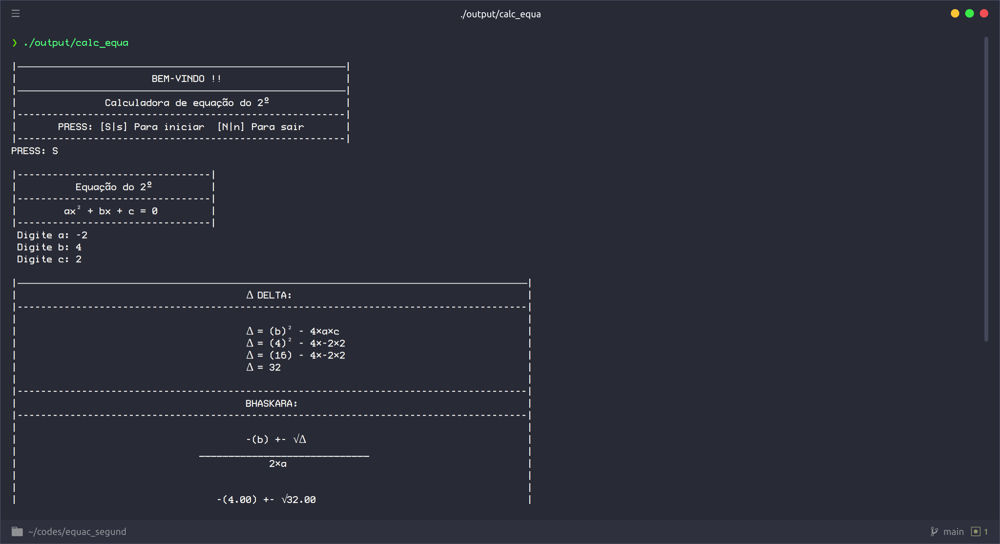
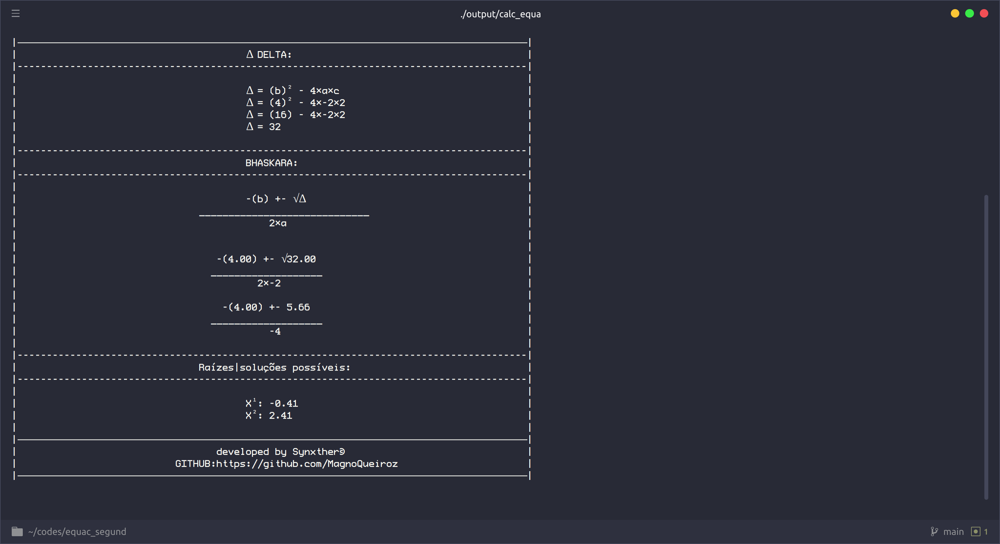

# Equação do segundo grau:
- Este algoritmo foi criado para calcular uma equação do segundo grau a partir de seu discriminante.
- Há algumas variáveis supérfluas no código que só estão lá para facilitar meu entendimento de como cada parte funciona.
- Dito isto ignore qualquer erro, ou me notifique que realizarei a correção.

## Como funciona:
- O usuário digita quais sao os números presentes na operação. Em seguida ele realiza o cálculo, imprimindo em tela o resultado.

## Como compilar:
- Para poder executar o script, você terá que usar o parametro -lm na hora da compilação.
```
    ggc -o nomearquivocompilar nomedoarquivo.c -lm
 ```  
## Imagens:
<div align="center">




</div>

