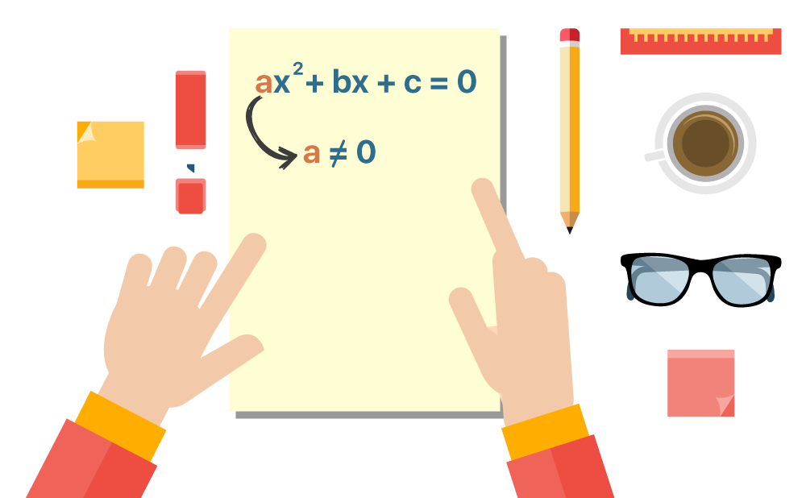

# Equação do 2º:

<div align="center">



<br>


</div>

- Este algoritmo foi criado para calcular uma equação do segundo grau a partir de seu discriminante.
- Há variáveis supérfluas no código que só estão lá para facilitar meu entendimento de como cada parte funciona.
- Dito isto ignore qualquer erro, ou me notifique que realizarei a correção.

## Como funciona:
- O usuário digita quais sao os números presentes na operação. Em seguida ele realiza o cálculo, imprimindo em tela o resultado.

## Como compilar:
- Para poder executar o script, você terá que usar o parâmetro -lm na hora da compilação.
```
gcc -o ./output/equac_second main.c ./src/clear_screen.c ./src/equationSecond.c ./src/functionWelcomeAndEndScreen.c  -lm
```
ou:
```
gcc -o nomearquivo.c -c arquviocompilar
```
## Imagens:
<div align="center">


</div>

